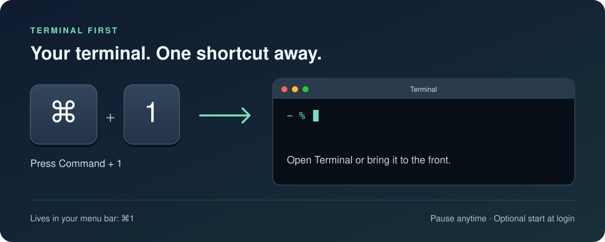

# Terminal First

**Press ⌘1 to open or focus Apple Terminal from any app.** A small macOS menu bar utility that keeps your terminal one shortcut away, with a settings window for when you want it.



**Version 1.2 · macOS 13 Ventura or later · Intel and Apple Silicon**

[App website](https://shimonnavon.github.io/terminal-first/) · [MIT License](LICENSE)

## Install

1. [Download the Mac installer](https://github.com/ShimonNavon/terminal-first/releases/download/v1.2.0/Terminal-First-1.2.dmg) and open the DMG.
2. Drag **Terminal First** onto **Applications** in the installer.
3. Open the app. A **⌘1** control appears in the menu bar and the Terminal First window opens on first launch.
4. Press **Command + 1** to open or focus Apple Terminal.

## The window

The Terminal First window shows whether ⌘1 is active, paused, or blocked by another shortcut utility, and offers switches for the shortcut and Start at Login plus Open Terminal and Quit buttons. It opens on first launch. To open it again, choose **Open Terminal First…** from the menu bar item or open the app from Applications while it is running. Closing the window (⌘W) keeps the app running in the menu bar.

## Menu controls

| Control | What it does |
| --- | --- |
| Open Terminal | Opens or focuses Apple Terminal without using the shortcut. |
| Pause / Enable ⌘1 | Releases or reserves Command + 1. |
| Start at Login | Optionally launches the app when you sign in. |
| Open Terminal First… | Shows the settings window. |
| Quit Terminal First | Stops the app and restores normal Command + 1 behavior. |

The shortcut uses the physical **1** key on the main keyboard. While active, it takes priority over ordinary app shortcuts. Another exclusive global hotkey utility can prevent registration; the app reports this.

No Accessibility or Input Monitoring permission is needed. The app does not record keystrokes or use the network.

## First open on another Mac

This build is locally signed, not Apple Developer ID signed or notarized. macOS may block the first launch. If you trust this copy, use **System Settings → Privacy & Security → Open Anyway** after attempting to open it. Managed Macs may prohibit this. Do not disable Gatekeeper.

## If you used the earlier Terminal helper

That helper and this app cannot own Command + 1 simultaneously. To try this app, first stop the old helper in Terminal:

```sh
launchctl bootout gui/$(id -u)/local.terminal-command-one
```

Then choose **Enable ⌘1** in the new app. The old helper's login plist, `local.terminal-command-one.plist`, must also be removed from `~/Library/LaunchAgents` to prevent it returning at login.

## Uninstall

Turn off **Start at Login**, quit Terminal First, then move the app to Trash.

## Build from source

Install Apple's Command Line Tools, then run from the repository root:

```sh
bash Source/build.sh
```

This creates `Terminal First App.zip` with both CPU architectures. `Source/Info.plist` contains the app identity and minimum macOS version.

## Validation

Both architectures compile and the extracted app passes strict code signature verification. Launch, the settings window, and shortcut-conflict reporting were checked on macOS 26.6.2. Successful hotkey activation and login startup of this packaged app have not been tested because the earlier helper already owns the shortcut on the test Mac.

## Public distribution

A Developer ID Application certificate and Apple notarization are needed for a normal verified-developer distribution. Neither is included here.

## License

[MIT](LICENSE) © 2026 Simon Navon.

## Website

The GitHub Pages site is served from `docs/` on `main`. Edits to `docs/index.html` are published when pushed to that branch.
